# gitrecon

Exploring, recognizing and listening to GitHub activity of users, organizations,
repositories and projects: collect events into a raw buffer, map who touches
what, and conclude labels for what is happening.

> Documentation online of project: https://gitrecon.readthedocs.io/

## Install

```sh
task install              # uv sync + npm install (git hooks)
export GITHUB_TOKEN=...   # optional; falls back to `gh auth token`, else 60 requests/hour
export OLLAMA_MODEL=llama3   # digest (local Ollama, OLLAMA_HOST)
export XAI_API_KEY=...       # posts (XAI_MODEL, default grok-4)
```

Secrets can also live in a dotenv file: `GITRECON_ENV_FILE`, the project `.env`,
or (for now) `__WORKSHOP/forge/.env` - existing variables always win.
LLM interfaces (Ollama, OpenAI-compatible enterprise endpoints) are on hold: TODO.

Or in a container: `task docker:run -- stars sarverott` (see `docs/guides/installation.md`).

## Usage

The quickest start: `task menu` (or `uv run gitrecon`) - a full-screen menu where every command,
task, example and manual is picked with the arrows and Enter.

```sh
# collect
gitrecon events public              # one poll of the public event stream
gitrecon events org:github --watch  # keep listening (ETag + X-Poll-Interval)
gitrecon events repo:owner/name
gitrecon gists                      # newest public gists
gitrecon gists --user octocat
gitrecon archive 2026-10-01-0 2026-10-01-23   # GH Archive hours (UTC), streamed to disk

gitrecon stars sarverott            # every repository a user has starred (--save keeps them)
gitrecon stars sarverott --urls     # ...just their addresses, one per line
gitrecon stars sarverott --json > sarverott-stars.json      # ...or all of it as a JSON file
gitrecon gist-catalog sarverott     # every gist: files, stars, comments, forks, commits, size
gitrecon repos sarverott --no-forks # own repositories; orgs sarverott; org-repos ORG
gitrecon repo-clone sarverott --dry-run   # into ~/__WORKSHOP/forge/sarverott/; also org-clone ORG, gist-clone USER
gitrecon links ..                   # harvest data source links from gist clones in ..
gitrecon links .. --kind feed --save

# more sources
gitrecon feeds --items              # RSS/Atom/RDF feeds from the link catalog (or give URLs); --save
gitrecon rfc --search quantum ssh   # RFC Editor index; --number 2026, --save
gitrecon blog --dump                # Apokryf blog articles as markdown (any blog URL); --save

# the map dataset (Hugging Face Apokryf/minimap-of-uce -> datasets/imperialmap)
gitrecon atlas pull
gitrecon atlas update               # gist links -> dnstrees, GitHub /meta -> ip-address-records
gitrecon atlas update --stars sarverott   # + user-namespace: owners of starred repos
gitrecon atlas status
gitrecon atlas push -m "message"    # HF_TOKEN from .env; --pr to open a Hub PR
task map:refresh && task map:push -- -m "message"          # the whole refresh + push

# content: summarize locally, then write drafts
gitrecon digest stars:sarverott     # Ollama map-reduce; also labels | links | file:PATH
gitrecon posts data/digests/<file>.md   # xAI: SEO article, tweet thread, LinkedIn, Mastodon

# for programs: most commands take --json (only data on stdout) or --urls (only addresses)
gitrecon stars sarverott --json | jq '.[].url'
gitrecon events org:github --watch --json      # JSON Lines, live
gitrecon label --name star-burst --urls

gitrecon analyze ~/__WORKSHOP/forge/rattish    # languages, lines, names, frameworks of cloned repos
gitrecon gitgraph . --format mermaid --save    # history across branches as a Mermaid gitGraph

# look
gitrecon status                     # what is in the raw buffer
gitrecon map                        # graph summary: nodes, relations, hubs
gitrecon map --node user:octocat    # neighbors of one entity
gitrecon label                      # labels with confidence and evidence

# text experiments
gitrecon text toc|tokens|rat [URL]
```

Data lands in `./data` (override with `GITRECON_DATA`) as gzip JSONL partitioned
by source and UTC hour.

## Labels

| Label | Target | Meaning |
|---|---|---|
| `declared-bot` | user | `[bot]` account or `type: Bot` |
| `burst` | user | many events within one window |
| `bot-like-cadence` | user | evenly spaced events (low gap variation) |
| `push-flood` | user | many commits pushed within one window |
| `repo-spree` | user | many repositories created within one window |
| `mass-forker` | user | many forks made within one window |
| `fork-wave` | repo | many forks of one repo within one window |
| `star-burst` | repo | many stars within one window |
| `mass-gist-drop` | user | many gists created within one window |

Thresholds live in `gitrecon.analysis.Thresholds`.

## Environment

```mermaid
%% Generated by https://gitdiagram.com/sarverott/gitrecon
flowchart TD

subgraph group_entry["User entry"]
  node_cli["CLI commands<br/>[__init__.py]"]
  node_menu["Interactive menu<br/>[app.py]"]
  node_config["Runtime config<br/>[config.py]"]
end

subgraph group_collection["Collection"]
  node_collect["Collection commands<br/>[collect.py]"]
  node_github["GitHub API<br/>[github_api.py]"]
  node_events["Event polling<br/>[events.py]"]
  node_gist["Gist collection<br/>[gists.py]"]
  node_stars["Star collection<br/>[stars.py]"]
  node_repos["Repository collection<br/>[repos.py]"]
  node_other_sources["Other sources"]
  node_links["Link catalog<br/>[links.py]"]
  node_raw[("Raw buffer<br/>[rawbuffer.py]")]
end

subgraph group_analysis["Recognition"]
  node_models["Entity models<br/>[base.py]"]
  node_map["Relationship map<br/>[graph.py]"]
  node_labeler["Label analysis<br/>[labeler.py]"]
  node_rules["Detection rules<br/>[rules.py]"]
end

subgraph group_content["Content tools"]
  node_digest["Digest summaries<br/>[summarize.py]"]
  node_digest_inputs["Digest inputs<br/>[inputs.py]"]
  node_llm["Chat clients<br/>[llm.py]"]
  node_posts["Draft posts<br/>[posts.py]"]
  node_text["Text utilities<br/>[tokenizer.py]"]
end

subgraph group_extensions["Atlas and menu"]
  node_atlas["Atlas updates<br/>[update.py]"]
  node_namespace["Atlas namespace<br/>[namespace.py]"]
  node_hub["Hugging Face Hub<br/>[huggingface.py]"]
  node_tui_parts["Menu components<br/>[widgets.py]"]
end

node_user(("User"))
node_github_service(("GitHub"))
node_ollama(("Ollama"))
node_xai(("xAI"))
node_hf_service(("Hugging Face"))

node_user -->|"runs commands"| node_cli
node_user -->|"opens menu"| node_menu
node_menu -->|"launches commands"| node_cli
node_cli -->|"dispatches collection"| node_collect
node_collect -->|"requests API data"| node_github
node_github -->|"calls REST API"| node_github_service
node_collect -->|"dispatches polling"| node_events
node_collect -->|"dispatches gist tasks"| node_gist
node_collect -->|"dispatches star tasks"| node_stars
node_collect -->|"dispatches repo tasks"| node_repos
node_collect -->|"dispatches feeds/blog/RFC"| node_other_sources
node_collect -->|"stores collected data"| node_raw
node_collect -->|"harvests links"| node_links
node_github -->|"uses API settings"| node_config
node_collect -->|"formats entities"| node_models
node_user -->|"inspects graph"| node_map
node_user -->|"requests labels"| node_labeler
node_labeler -->|"applies rules"| node_rules
node_rules -->|"produces labels"| node_models
node_user -->|"requests summary"| node_digest
node_digest -.->|"loads inputs"| node_digest_inputs
node_digest -.->|"summarizes with model"| node_llm
node_llm -->|"sends chat requests"| node_ollama
node_user -->|"requests drafts"| node_posts
node_posts -->|"generates drafts"| node_llm
node_llm -->|"sends chat requests"| node_xai
node_user -->|"runs text tools"| node_text
node_user -->|"updates atlas"| node_atlas
node_atlas -->|"updates namespace"| node_namespace
node_user -->|"pulls or pushes dataset"| node_hub
node_hub -->|"transfers dataset"| node_hf_service
node_menu -->|"renders interface"| node_tui_parts

click node_cli "https://github.com/sarverott/gitrecon/blob/master/src/gitrecon/cli/__init__.py"
click node_menu "https://github.com/sarverott/gitrecon/blob/master/src/gitrecon/tui/app.py"
click node_config "https://github.com/sarverott/gitrecon/blob/master/src/gitrecon/config.py"
click node_collect "https://github.com/sarverott/gitrecon/blob/master/src/gitrecon/cli/collect.py"
click node_github "https://github.com/sarverott/gitrecon/blob/master/src/gitrecon/sources/github_api.py"
click node_events "https://github.com/sarverott/gitrecon/blob/master/src/gitrecon/sources/events.py"
click node_gist "https://github.com/sarverott/gitrecon/blob/master/src/gitrecon/sources/gists.py"
click node_stars "https://github.com/sarverott/gitrecon/blob/master/src/gitrecon/sources/stars.py"
click node_repos "https://github.com/sarverott/gitrecon/blob/master/src/gitrecon/sources/repos.py"
click node_other_sources "https://github.com/sarverott/gitrecon/tree/master/src/gitrecon/sources"
click node_links "https://github.com/sarverott/gitrecon/blob/master/src/gitrecon/sources/links.py"
click node_raw "https://github.com/sarverott/gitrecon/blob/master/src/gitrecon/storage/rawbuffer.py"
click node_models "https://github.com/sarverott/gitrecon/blob/master/src/gitrecon/models/base.py"
click node_map "https://github.com/sarverott/gitrecon/blob/master/src/gitrecon/mapping/graph.py"
click node_labeler "https://github.com/sarverott/gitrecon/blob/master/src/gitrecon/analysis/labeler.py"
click node_rules "https://github.com/sarverott/gitrecon/blob/master/src/gitrecon/analysis/rules.py"
click node_digest "https://github.com/sarverott/gitrecon/blob/master/src/gitrecon/digest/summarize.py"
click node_digest_inputs "https://github.com/sarverott/gitrecon/blob/master/src/gitrecon/digest/inputs.py"
click node_llm "https://github.com/sarverott/gitrecon/blob/master/src/gitrecon/digest/llm.py"
click node_posts "https://github.com/sarverott/gitrecon/blob/master/src/gitrecon/digest/posts.py"
click node_text "https://github.com/sarverott/gitrecon/blob/master/src/gitrecon/text/tokenizer.py"
click node_atlas "https://github.com/sarverott/gitrecon/blob/master/src/gitrecon/atlas/update.py"
click node_namespace "https://github.com/sarverott/gitrecon/blob/master/src/gitrecon/atlas/namespace.py"
click node_hub "https://github.com/sarverott/gitrecon/blob/master/src/gitrecon/hub/huggingface.py"
click node_tui_parts "https://github.com/sarverott/gitrecon/blob/master/src/gitrecon/tui/widgets.py"

classDef toneNeutral fill:#f8fafc,stroke:#334155,stroke-width:1.5px,color:#0f172a
classDef toneBlue fill:#dbeafe,stroke:#2563eb,stroke-width:1.5px,color:#172554
classDef toneAmber fill:#fef3c7,stroke:#d97706,stroke-width:1.5px,color:#78350f
classDef toneMint fill:#dcfce7,stroke:#16a34a,stroke-width:1.5px,color:#14532d
classDef toneRose fill:#ffe4e6,stroke:#e11d48,stroke-width:1.5px,color:#881337
classDef toneIndigo fill:#e0e7ff,stroke:#4f46e5,stroke-width:1.5px,color:#312e81
classDef toneTeal fill:#ccfbf1,stroke:#0f766e,stroke-width:1.5px,color:#134e4a
class node_cli,node_menu,node_config,node_user toneBlue
class node_collect,node_github,node_events,node_gist,node_stars,node_repos,node_other_sources,node_links,node_raw toneAmber
class node_models,node_map,node_labeler,node_rules toneMint
class node_digest,node_digest_inputs,node_llm,node_posts,node_text toneRose
class node_atlas,node_namespace,node_hub,node_tui_parts,node_github_service,node_ollama,node_xai,node_hf_service toneIndigo
```



Services around gitrecon - databases, gitea, ollama, n8n, traefik, runners and more - are
docker compose files in `services/<group>/`, behind one gateway (traefik: every web service
is `<name>.gr.rs-tech.online`, or `<name>.localhost:8880` on the host; a WireGuard bubble for the rest),
started with their dependencies:
`task services:list`, `task services:up -- gitea n8n`. Their data lives in
`datasets/_dockdrives/<volume>` (`task services:drives`, `task services:backup`); see
`docs/guides/environment.md`.

## Examples and documentation

- `examples/<title>/` - runnable Jupyter notebooks with concrete calls (`task examples:list`,
  `task examples:launch`, `task examples:marimo`); see [examples/README.md](examples/README.md)
- `docs/` - guides and a glossary (an Obsidian vault, built with MkDocs on Read the Docs):
  `task manuals` reads them in the terminal, `task docs:serve` previews the site
- `task help` lists every task

## Development

```sh
task test
task commit
```

Work goes through the BOS craft loop (`development → revision → testing →
releasing → master`), with Conventional Commits, metadata sync and automated
releases. See [CONTRIBUTING](.github/CONTRIBUTING.md) and [AGENTS.md](AGENTS.md).
