# Scrapnote: grammars in resources, code analysis, git graphs

> 2026-10-04 · [UNIXUSAT=1791145526438] · gitrecon `development`
> A scrapnote: what was built, what I think about it, what I would like to know.

## Built

- `resources/grammars/lexical/*.lark` - lexical patterns of five language families (C-like,
  Python, `#`-comment, `--`-comment, markup); `resources/languages.yml` (49 languages),
  `resources/frameworks.yml` (8 manifests, 97 packages, 35 marker files); the JSON grammar moved
  to `resources/grammars/json.lark`.
- `gitrecon.code` + `gitrecon analyze` - languages, code/comment lines, names, links, Python
  structure (`ast`), frameworks. gitrecon itself: 0.5 s for 279 files.
- `gitrecon.mapping.gitgraph` + `gitrecon gitgraph` - history across all branches as a Mermaid
  gitGraph.
- A real Mermaid renderer for checking (`@mermaid-js/mermaid-cli` with the Chrome in
  `~/.cache/puppeteer`): the git graphs of gitrecon, shakespeare-mobile and bos-skillset, and
  the two network diagrams from the previous round, all render.

## gitrecon's own loop, newest 40 commits

```mermaid
---
config:
  gitGraph:
    mainBranchName: "master"
    showCommitLabel: false
---
gitGraph
  %% the newest 40 commits; older history is not drawn
  commit id:"2b06e22" tag:"v0.3.0" type:HIGHLIGHT
  branch "development"
  commit id:"4c358b1" type:HIGHLIGHT
  commit id:"2c5fd3e"
  commit id:"d7e70ed"
  checkout "master"
  branch "revision"
  merge "development" id:"8254c29"
  checkout "master"
  branch "testing"
  merge "revision" id:"96fdb6a"
  checkout "master"
  branch "releasing"
  merge "testing" id:"d084819"
  checkout "master"
  merge "releasing" id:"c41af81"
  commit id:"be0b3b7" tag:"v0.3.1" type:HIGHLIGHT
  checkout "development"
  merge "master" id:"f9b4565"
  commit id:"3a6112d"
  commit id:"feaf070"
  checkout "revision"
  merge "development" id:"c9f55b6"
  checkout "testing"
  merge "revision" id:"27c1221"
  checkout "releasing"
  merge "testing" id:"d9e6c72"
  checkout "master"
  merge "releasing" id:"9924009"
  commit id:"e7a8795" tag:"v0.3.2" type:HIGHLIGHT
  checkout "development"
  merge "master" id:"74b0880"
  checkout "revision"
  merge "development" id:"bbbaa08"
  checkout "testing"
  merge "revision" id:"8ad9469"
  checkout "releasing"
  merge "testing" id:"a1404a3"
  checkout "master"
  merge "releasing" id:"a7c63df"
  commit id:"de4242b" tag:"v0.3.3" type:HIGHLIGHT
  checkout "development"
  commit id:"db4dfbd"
  checkout "revision"
  merge "development" id:"7f0188e"
  checkout "testing"
  merge "revision" id:"cc6d7b8"
  checkout "releasing"
  merge "testing" id:"6212b5a"
  checkout "master"
  merge "releasing" id:"cd1ef03"
  commit id:"1950650" tag:"v0.3.4" type:HIGHLIGHT
  checkout "development"
  commit id:"de908e0"
  checkout "revision"
  merge "development" id:"84df2f1"
  checkout "testing"
  merge "revision" id:"f584799"
  checkout "releasing"
  merge "testing" id:"39ba070"
  checkout "master"
  merge "releasing" id:"4904b51"
  commit id:"f0e7f94" tag:"v0.4.0" type:HIGHLIGHT
  checkout "development"
  merge "master" id:"872ff3e"
  commit id:"8e379cf"
  commit id:"ea28d9c"
  commit id:"c4e40d9"
  commit id:"6d19e7b"
```

## Reflections

1. **Lexical is the right first layer, and it is honest about its limit.** A lexer knows
   comments, strings, names - not what a function is. That already answers "what is this
   repository made of" for any language. The next layer, *structure*, has two roads:
   - more Lark: small Earley grammars for declaration patterns per family (function, class,
     import) - in the spirit of `resources/`, good for families, fragile on real-world code;
   - tree-sitter: real syntax trees for ~100 languages, a dependency with compiled grammars.
   For "many languages, many frameworks" I would take tree-sitter for structure and keep Lark
   for what is ours to define.
2. **What is ours to define: humanish.** The word-chain tokenizer and the a12y glossary are
   already a lexical layer for natural language (`gitrecon.text`). A Lark grammar *over word
   chains* - sentences as statements with a subject, an action, objects - is where
   "descriptive language becomes executable" would start: a controlled language first
   (commit messages are one: `type(scope): subject`), free text later. The RAT script format
   is also only *written* today; a `resources/grammars/rat.lark` would let it be *read*.
3. **The git graph is an interpretation.** Git has no lanes; "which branch is this commit on"
   is decided by first parents and a priority list. For a BOS loop repository that reads
   exactly as intended. For a repository with long-lived parallel branches the picture is
   valid but one of several possible.
4. **Dependencies grew.** The core list now has chromadb, langchain, litellm, nanobot,
   networkx, ollama, openai, paramiko, scapy; only docker and podman are imported by the code
   so far. The image went from 125 MB (Alpine) to about 950 MB (Debian slim, because chromadb's
   onnxruntime has no Alpine build). If the container should stay light, these belong in
   optional extras (`gitrecon[llm]`, `gitrecon[net]`) until code uses them.

## Questions

- [ ] Structure layer: tree-sitter as a dependency, or Lark grammars only?
- [ ] A grammar for RAT scripts (reading them back) - wanted?
- [ ] Humanish: is there a written description of its sentences to start a grammar from?
- [ ] Where should analysis results live - the raw buffer (`data/raw/analysis/`), the map
      dataset (a `data-heuristicality` or new area), or both?
- [ ] The heavy core dependencies: keep in core, or move to extras until used?
