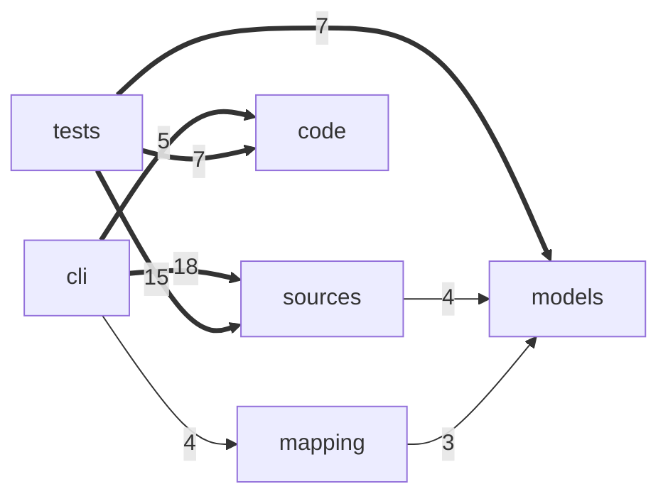

# Scrapnote: merging the remote in, the history as a score, imports inside a repository

> 2026-10-05 · [UNIXUSAT=1791156397474] · gitrecon `development`

## The collision

`development` had 3 commits only here and 22 only on GitHub: four releases (0.4.1 -> 0.5.2)
had gone through the loop and been merged back, and the commits made here before pulling
that could not be pushed. The two sides touched different lines, so the merge was clean.

It has a procedure now: `task merge:check` (look only) and `task merge:remote`
(`scripts/merge_remote.py`; guide: [[committing-and-releasing]]). It tries the merge in memory
first, refuses to work over uncommitted changes, never pushes, and prints the way back.

## Answers taken in

| # | Question | Answer | Done |
| --- | --- | --- | --- |
| 1 | CaptorLex step 2: which circle first? | one repository, then the owner's repositories, then all known public ones | the first circle: `gitrecon imports` |
| 2 | translation of what? | later, with repositories in Chinese | nothing |
| 3 | the git graph as a score | yes | `gitrecon score` |

## Imports inside this repository

116 files read, 260 imports between them, no cycles. The file most used is `config.py` (26
files need it); the file using most is `cli/collect.py` (18). Folder level:



(the heaviest arrows only; `gitrecon imports . --format mermaid --save` draws all of them.)

## The score

Lanes are strings, commits are notes, a merge is a chord. The newest commits of this
repository, as `gitrecon score . --max-commits 28` prints them:

```
e|--------------------------------------------5------------5-5----|
B|------------------10-0-------10-5-------7-3-3-------0-0--0------|
G|----------------3-3--------0-0--------3-3---------0-0-----------|
D|--------------7-7--------0-0--------0-0---------7-7-------------|
A|------------3-3--------3-3--------5-5---------5-5---------------|
E|5-3--3--3-3-----------------------3-----------3------------3----|
```

The staircase is the BOS loop: one change climbing development -> revision -> testing ->
releasing -> master, each merge a two-string chord. `--format midi` writes a file any player
opens; `--format abc` is text that abcjs and similar tools engrave and play.

## Open

- [ ] Step 2, second circle: between the repositories of one owner. What joins two
      repositories - a dependency in a manifest that names another of the owner's
      repositories (package name = repository name), a git submodule, a URL in the code, or
      all three?
- [ ] Go, Rust and Java imports are not read yet: they name modules, not files, and need their
      own resolution (go.mod module path, crate layout, source roots).
- [ ] The score ignores who committed. One instrument per author would make it a band.
