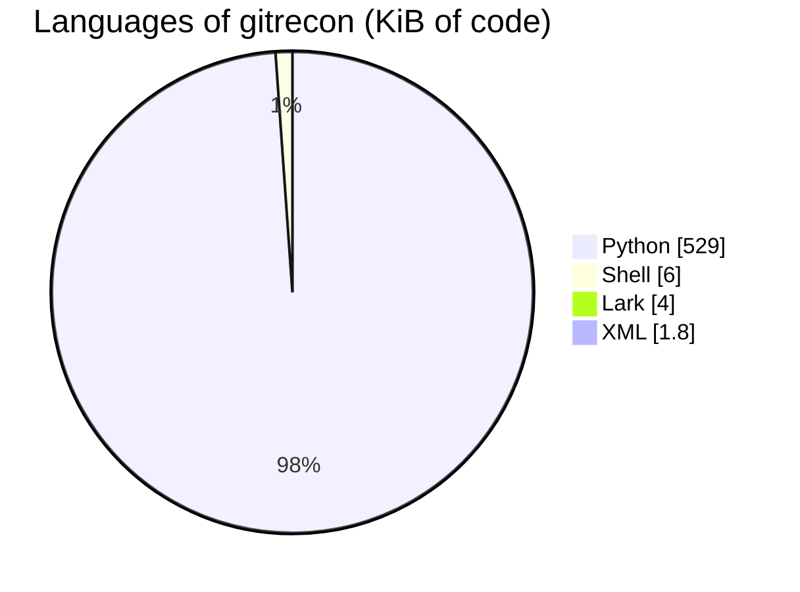
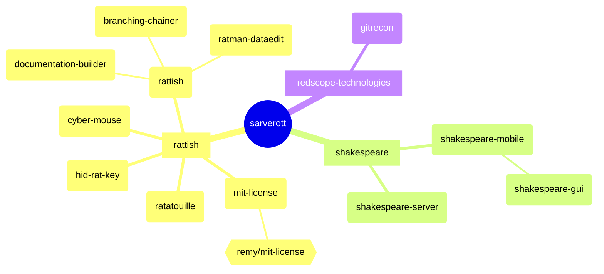
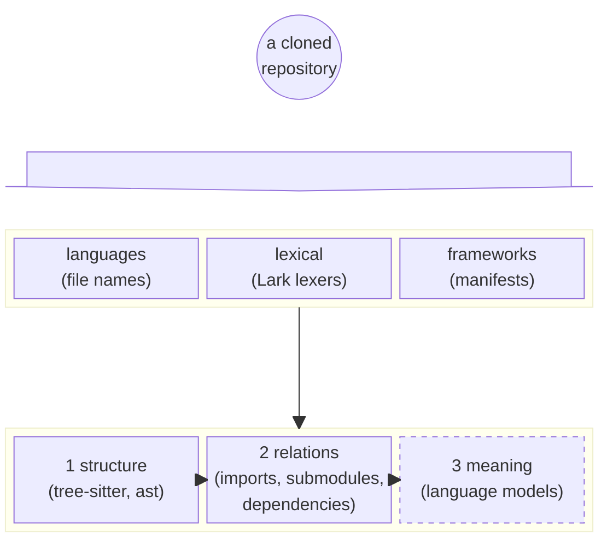
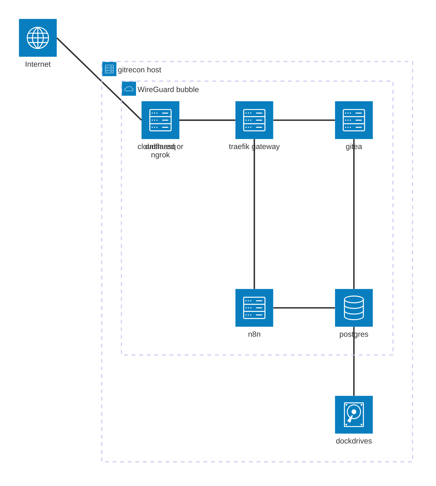
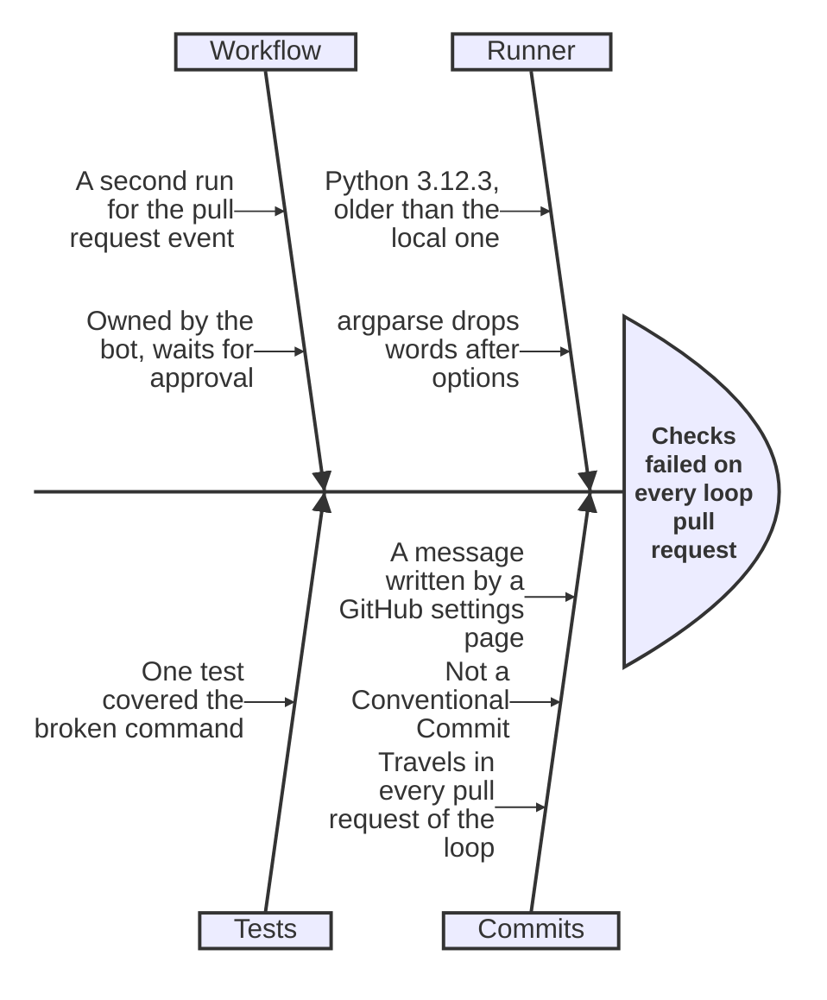
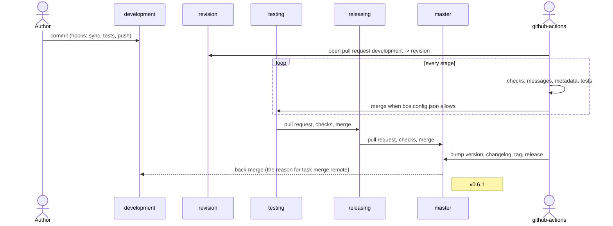

# Scrapnote: contributors, the ignorelist, the outward ties, and drafts for every kind of diagram

> 2026-10-05 · [UNIXUSAT=1791176132225] · gitrecon `development`

## Answers taken in

| # | Question | Answer | Done |
| --- | --- | --- | --- |
| 1 | the third circle: where to start | a fork's parent first; then dependencies - public registry, custom registry, straight from git, a file behind http; stars after all of them | `gitrecon relations REPOSITORY` up to the dependencies |
| 2 | bots in the band | a switch `--ignorelist` and a file of identities; contributors listed properly first; the same file later for AUTHORS | `gitrecon contributors`, `resources/ignorelist.txt`, `--ignorelist` on `contributors` and `score` |

On "the stars already collected": I meant the ones gathered *so far* by `gitrecon stars USER
--save` - what sits in the raw buffer today - not something that comes earlier in the order.
In the order they stay where you put them: after every kind of dependency. Two directions
exist and both are a later step: who starred this repository (stargazers), and what its
owner starred.

An addition to the order, for you to place or reject: `local` - a dependency that is a path
on disk (`file:../shakespeare-gui` in shakespeare-mobile). I put it right after `fork`, as it
is really a tie of the second circle showing through.

And yes: npm does take a dependency from a plain web address - a tarball URL as the version.
So do pip (a wheel or archive URL) and uv.

## What the new readers found

- `gitrecon contributors .`: two identities - the release bot (60 commits, 45 of them
  merges) and the author (48 commits, +40 179 lines). With `--ignorelist` one remains.
- `gitrecon contributors ~/__WORKSHOP/forge/rattish/mit-license`: 1162 contributors.
- `gitrecon relations ~/__WORKSHOP/forge/rattish/mit-license`: a fork of `remy/mit-license`,
  29 registry dependencies. `library-helper` (apokaliptium): `forge-std` straight from git.
- An ignorelist lesson: `*[bot]` read as a shell pattern means "ends in b, o or t" - which
  ignored the author and kept the bot. Patterns now know only `*` and `?`.

## Drafts: what each Mermaid diagram could show

All of these are written by hand from real data of this workshop and render in Mermaid 12.1.
None is generated by a command yet, except the pies.

### pie - *built*: shares of anything

`contributors --format pie`, `analyze --format pie` (languages), `relations REPOSITORY
--format mermaid` (kinds of ties).

### mindmap - an owner at a glance

Shapes as the legend: a circle is the user, a square an organization (or a scope of the
forge), a rounded box a repository, a hexagon something outside (a fork's parent). Nesting
under a repository = a tie of the second circle. Would be `gitrecon network USER --format
mindmap`, and the same shape draws a repository's folders.

### block - layers and pipelines

Things that are *stacked*, not connected: the depths of reading, the path of data
(collect -> buffer -> map -> label).

### architecture - the services

Can be generated from `services/**/*.compose.yaml`: a group per profile, a service per
container, edges from `depends_on` and from the traefik routes.

### ishikawa - why something happened

A fishbone answers "what led to this" - exactly the shape of a **label with its evidence**:
the head is the conclusion (`push-flood`, `fix-heavy`), each bone a rule and what it
observed. And of an incident, like this morning's:

### treeView - a repository's folders

With the notes after `##` filled from the analysis (language, lines, what a folder imports);
also an organization with its members. Ready-made pictures for posts.

### sequence - who did what, in which order

One change travelling the loop, with the actors; the same for a workflow run (jobs as
participants, steps as messages). The gitGraph shows *where* commits are; this shows *who
moved them and when*.

### math - formulas

Mermaid draws `$$...$$`; decoding them is a different job. A first, small reader exists:
`gitrecon.text.mathtext` (extra `math`: SymPy, through its Lark-based LaTeX parser).

- reads: `\sqrt{x+3}` -> `sqrt(x + 3)`, `\frac{1}{2} \pi r^2` -> `pi*r**2/2`, `a + b = c`
  -> an equation, sums, integrals;
- says "ambiguous" rather than guessing: `\cos(t)+\sin(t)` has two readings for the parser;
- does not read layout: `cases`, matrices, `\overbrace`, `\stackrel`. The Wikipedia line
  about the square root of 6 is such a case - it is an *argument* (with "invalid" written
  over an equals sign), not one expression. Reading it means splitting it into its steps
  first; each step then is ordinary: `\sqrt{6} = \sqrt{2} \cdot \sqrt{3}` evaluates to true.

### Wikipedia

Not started. A note for when it is: the `wikipedia` package wraps the MediaWiki API and is
enough for summaries and page text; formulas arrive as LaTeX inside `<math>` and would go to
the reader above; a `sources/wikipedia.py` next to feeds and RFCs, saving into the raw buffer.

## Open

- [ ] Which diagram first as a real command - the mindmap of an owner, the tree view of a
      repository, or the architecture of the services?
- [ ] `local` ties: after `fork` as placed, or do they belong to the second circle only?
- [ ] AUTHORS: write it into the repository on every release (a step of the loop), or keep
      it a command the author runs?
